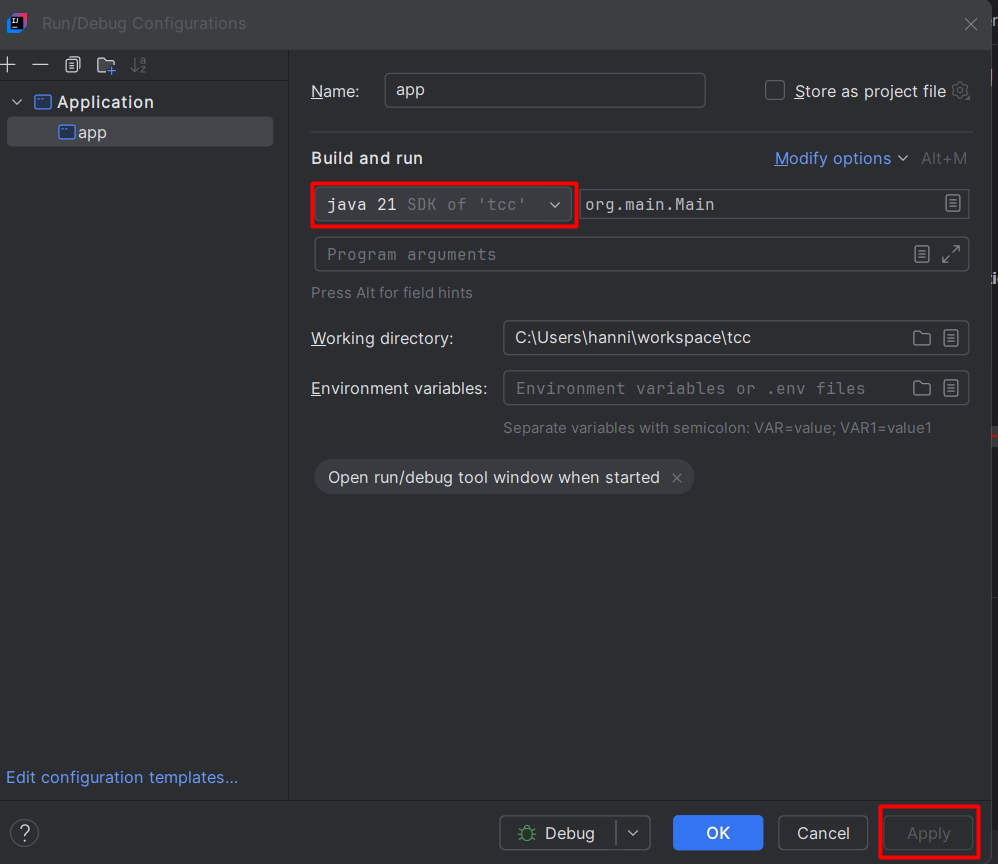
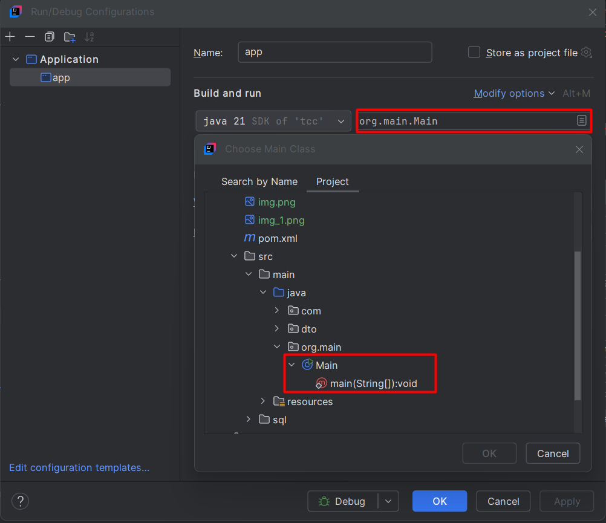

# Instalação e Configuração do Projeto

## Requisitos Mínimos
- Java 21 ou superior

### Instalação do Java 21

Baixe e instale o Java 21 a partir do link abaixo:

[Download Java 21](https://download.oracle.com/java/24/latest/jdk-24_windows-x64_bin.exe)

SHA256 Checksum disponível no site da Oracle.

---

## Instalação e Configuração do IntelliJ IDEA

Baixe e instale o IntelliJ IDEA:

[Download IntelliJ IDEA](https://www.jetbrains.com/idea/download/?section=windows)

### Configuração do IntelliJ IDEA para Spring Boot

Como o projeto utiliza Spring Boot, é necessário configurar o **Application Configuration** para iniciar o projeto corretamente.

#### Passos:
1. No canto superior direito, clique em **"More Actions"**:


2. Defina o Java no ambiente do IntelliJ IDEA:

  

3. Configure a classe **Main**:

  

---

## Instalação do Docker

Baixe e instale o Docker Desktop:

[Download Docker](https://www.docker.com/products/docker-desktop/)

### Configuração do Docker no Projeto

No projeto, foi criado o arquivo `docker-compose.yml`, que configura um container **Oracle SQL** para ser utilizado como banco de dados.

Para executar o container do Oracle SQL no Docker, abra o terminal/CMD na raiz do projeto e execute o seguinte comando:

```sh
docker compose up -d
```

---

## Configuração do GitHub Desktop

Caso ainda não tenha o **GitHub Desktop**, baixe e instale:

[Download GitHub Desktop](https://desktop.github.com/)

Link do repositório do projeto: https://github.com/DataBaseAdmin84/tccII.git

após clonar o repositório, abra o projeto no IntelliJ IDEA.

## Configuração do Banco de Dados

Para configurar o banco de dados, é necessário criar um usuário e uma senha no Oracle SQL.

### Passos para Configuração do Banco de Dados
1. Abra o **Oracle SQL Developer**.
2. Crie um novo usuário com as seguintes informações:
3. Usuário: `tcc`
4. Senha: `teste`
5. Conceda as permissões necessárias para o usuário `tcc`:

```sql
CREATE USER tcc IDENTIFIED BY teste;
GRANT CONNECT, RESOURCE TO tcc;

ALTER USER tcc QUOTA UNLIMITED ON USERS;
```
6. Crie as tabelas necessárias para o projeto. As tabelas estão localizadas no diretório `src/main/resources/sql` do projeto.
7. Execute os scripts SQL para criar as tabelas no banco de dados Oracle SQL.
8. Certifique-se de que o banco de dados esteja rodando corretamente e que as tabelas foram criadas com sucesso.
9. Configure o arquivo `application.properties` localizado em `src/main/resources` com as informações do banco de dados:

```properties
server.port=8080
spring.thymeleaf.cache=false
spring.datasource.url=jdbc:oracle:thin:@localhost:1521/FREE
spring.datasource.username=tcc
spring.datasource.password=teste
spring.datasource.driver-class-name=oracle.jdbc.OracleDriver
spring.jpa.database-platform=org.hibernate.dialect.OracleDialect
spring.web.resources.static-locations=file:uploads/
spring.servlet.multipart.max-file-size=50MB
spring.servlet.multipart.max-request-size=50MB
````

10. Certifique-se de que o banco de dados esteja acessível e que as credenciais estejam corretas.
11. Reinicie o projeto no IntelliJ IDEA para aplicar as configurações.
12. Após reiniciar, o projeto deve estar configurado e pronto para uso.
13. Para acessar a aplicação, abra o navegador e acesse `http://localhost:8080`.
14. Certifique-se de que o Docker esteja rodando e que o container do Oracle SQL esteja ativo.
15. Caso encontre algum erro, verifique os logs do IntelliJ IDEA para identificar possíveis problemas de configuração ou conexão com o banco de dados.
