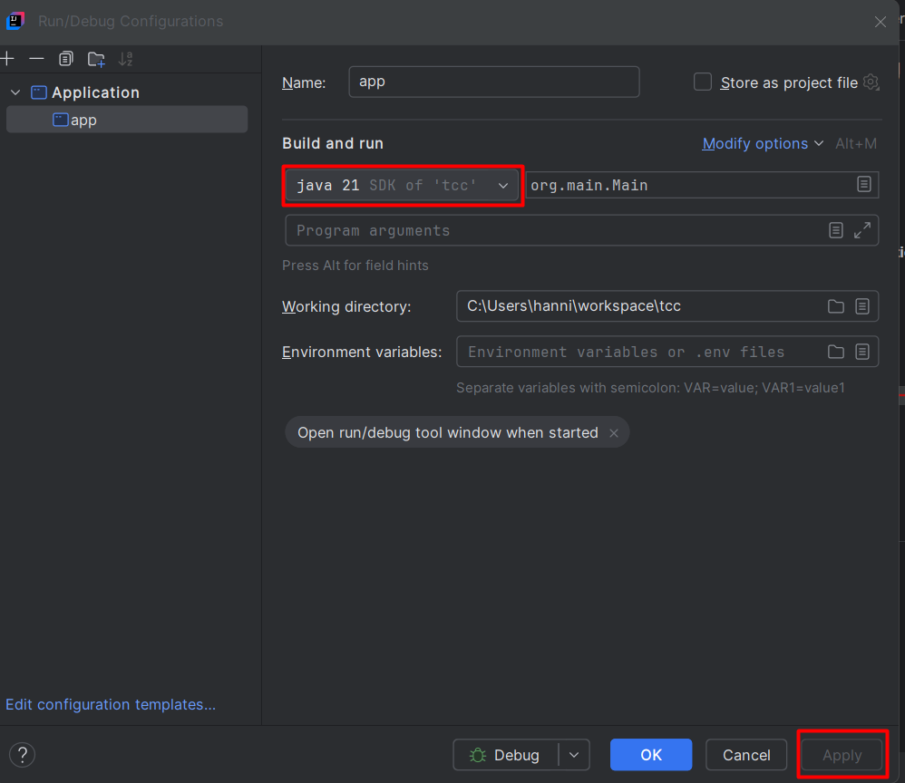
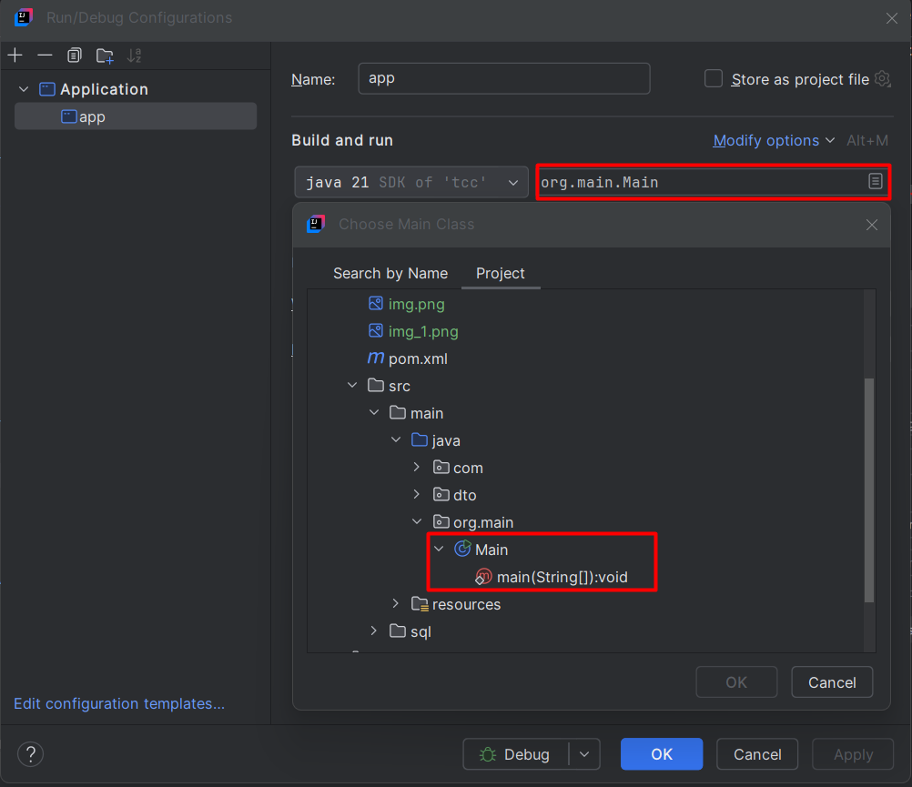

# Instalação e Configuração do Projeto

## Requisitos Mínimos
- Java 21 ou superior

### Instalação do Java 21

Baixe e instale o Java 21 a partir do link abaixo:

[Download Java 21](https://download.oracle.com/java/24/latest/jdk-24_windows-x64_bin.exe)

SHA256 Checksum disponível no site da Oracle.

---

## Instalação e Configuração do IntelliJ IDEA

Baixe e instale o IntelliJ IDEA:

[Download IntelliJ IDEA](https://www.jetbrains.com/idea/download/?section=windows)

### Configuração do IntelliJ IDEA para Spring Boot

Como o projeto utiliza Spring Boot, é necessário configurar o **Application Configuration** para iniciar o projeto corretamente.

#### Passos:
1. No canto superior direito, clique em **"More Actions"**:


2. Defina o Java no ambiente do IntelliJ IDEA:

  

3. Configure a classe **Main**:

  

---

## Instalação do Docker

Baixe e instale o Docker Desktop:

[Download Docker](https://www.docker.com/products/docker-desktop/)

### Configuração do Docker no Projeto

No projeto, foi criado o arquivo `docker-compose.yml`, que configura um container **Oracle SQL** para ser utilizado como banco de dados.

Para executar o container do Oracle SQL no Docker, abra o terminal/CMD na raiz do projeto e execute o seguinte comando:

```sh
docker compose up -d
```

---

## Configuração do GitHub Desktop

Caso ainda não tenha o **GitHub Desktop**, baixe e instale:

[Download GitHub Desktop](https://desktop.github.com/)

